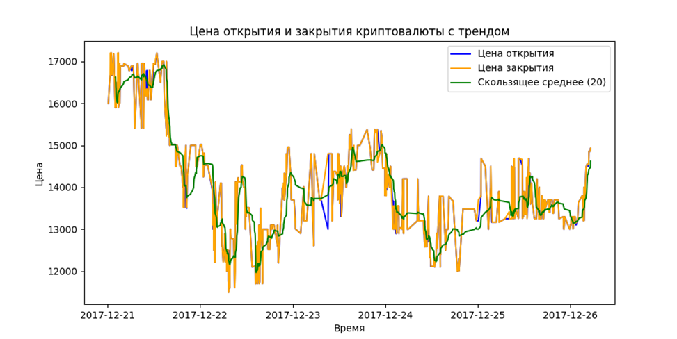
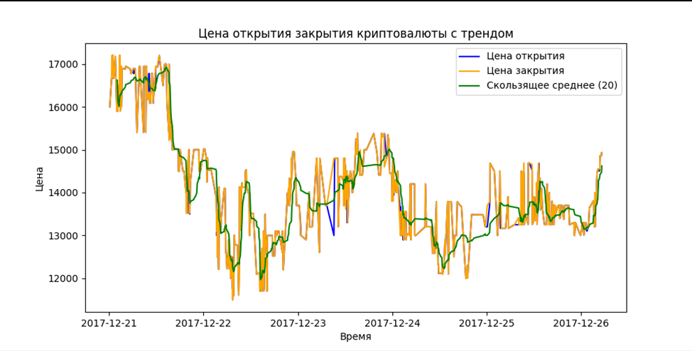
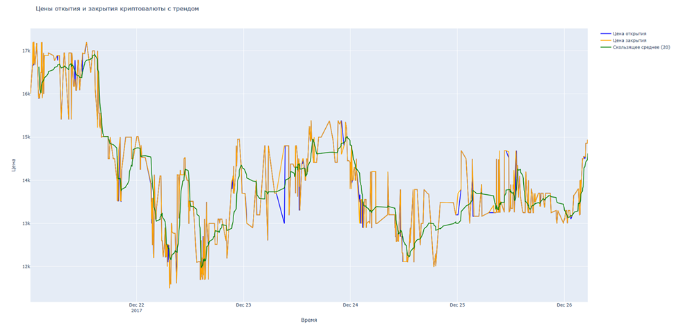
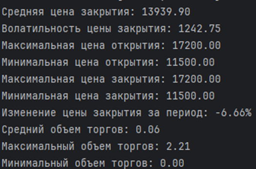

# Сравнение библиотек визуализации данных: Matplotlib, Seaborn и Plotly.

## Обзор

Данный проект демонстрирует сравнение трех популярных библиотек визуализации данных на Python: Matplotlib, Seaborn и Plotly. В проекте используются исторические данные о криптовалютной паре BTC-USD. Сравнение включает удобство использования, возможности визуализации и производительность.

## Основные возможности

- Matplotlib: Статичные графики с высокой степенью кастомизации.
- Seaborn: Упрощенное создание статистических визуализаций.
- Plotly: Интерактивные графики с поддержкой 3D и карт.

## Установка

1. Создайте виртуальное окружение (рекомендуется).
2. Установите зависимости из файла requirements.txt:

  
    pip install -r requirements.txt
   
## Запуск

1. Скачать и распаковать файл-zip с данными в папку /data.
2. Запустите основной файл main.py для выполнения программы.
3. Скрипты визуализации находятся в папке visualizations/, запускаются для генерации графиков.

## Скриншоты

### Пример графика Matplotlib:

### Пример графика Seaborn:

### Пример графика Plotly:

### Пример вывода статистики:

## Структура проекта

    ├── data/
    ├── scrin_result/
    ├── visualizations/
    ├── custom_statistics.py
    ├── main.py
    ├── README.md
    ├── requirements.txt
    └── temp-plot.html
